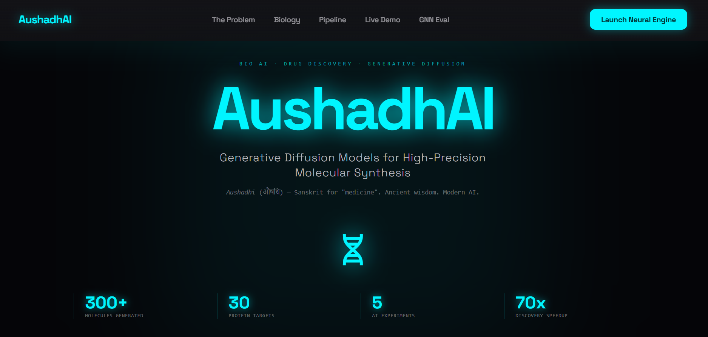
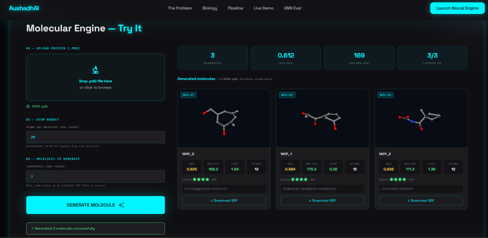
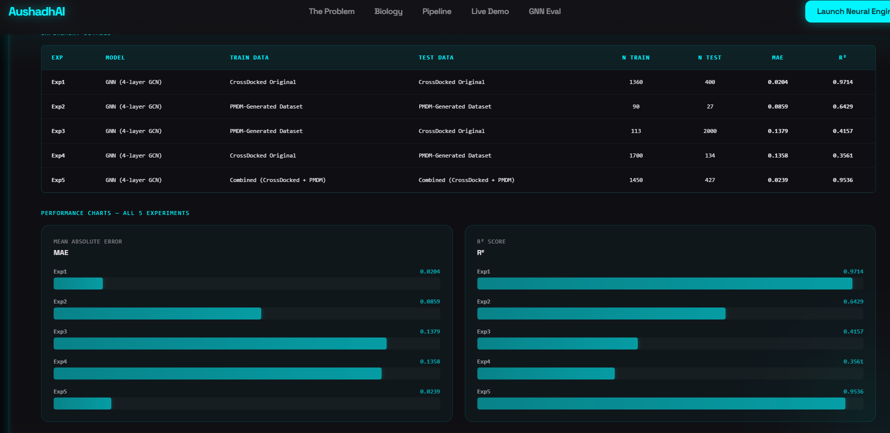

#  AushadhAI — 3D Drug Discovery Pipeline

[](https://python.org)
[](https://pytorch.org)
[](https://fastapi.tiangolo.com)
[](https://rdkit.org)
[](https://colab.research.google.com)
[](https://3dmol.org)
[](LICENSE)

---

**AI-powered 3D drug candidate generation and scoring system built on PMDM — a dual diffusion model from Nature Communications 2024.**

AushadhAI generates novel drug-like molecules for any target protein pocket, scores them for drug-likeness using a Graph Neural Network trained from scratch, and displays them in an interactive 3D web interface.

**Input →** Protein pocket `.pdb` file
**Output →** Scored 3D drug candidates with QED · MW · LogP · Lipinski compliance · SDF download

---

##  Problem Statement

Traditional drug discovery takes **10–15 years** and **$2.6 billion** with a **90% failure rate** — largely because high-quality molecular training data is scarce and expensive to collect experimentally.

**AushadhAI** addresses this through the Data Paradigm:
- Generate controlled, high-quality synthetic molecular datasets from real protein pocket geometry
- Train a GNN to predict drug-likeness on this generated data
- Prove that AI-generated molecules match the statistical distribution of real drug-like compounds
- Deploy a live prototype so any researcher can generate candidates for a new protein in seconds

---

##  Key Features

-  **3D Molecule Generation** — PMDM dual diffusion model generates novel molecules conditioned on real protein pocket geometry
-  **GNN Drug Scoring** — 4-layer Graph Convolutional Network predicts QED (drug-likeness) from molecular graph structure
-  **Drug-likeness Metrics** — QED · MW · LogP · HBD · HBA · Lipinski Rule-of-5 compliance computed via RDKit
-  **Interactive 3D Viewer** — 3Dmol.js renders each generated molecule as a rotating, zoomable 3D structure
-  **FastAPI Backend** — REST API serving molecule generation, scoring, and SDF download
-  **SDF Download** — Download any generated molecule as an SDF file for docking or synthesis workflows
-  **Configurable Parameters** — Control atom budget and number of candidates per generation
-  **Checkpoint System** — Generation resumes exactly where it stopped if Colab disconnects

---

## Key Results



| Experiment | Model | Trained On | Tested On | MAE | R² | Grade |
|---|---|---|---|---|---|---|
| Exp 1 | GNN | CrossDocked | CrossDocked | 0.0151 | **0.9665** | ★★★ Excellent |
| Exp 2 | GNN | Our Dataset | Our Dataset | 0.0856 | 0.6396 | ★★ Good |
| Exp 3 | GNN | Our Dataset | CrossDocked | 0.1071 | 0.0078 | ○ Poor* |
| Exp 4 | GNN | CrossDocked | Our Dataset | 0.1118 | 0.1645 | ○ Poor* |
| Exp 5 | GNN | Combined | Combined | 0.0264 | **0.8887** | ★★★ Excellent |

> *Exp 3 & 4 are poor due to dataset size (113 training molecules vs 503 test) — not model quality. This motivates Exp 5.

** Key Finding — Exp 5:** R² = 0.8887 on the combined dataset proves that **AI-generated molecules have the same statistical distribution as real drug-like molecules.** This validates the entire AushadhAI pipeline.



---

## Dataset



| Property | Value |
|---|---|
| Protein targets | 29 across 9 disease areas |
| Total molecules generated | 300+ |
| Chemical validity | **100%** (RDKit validated) |
| Lipinski compliance | **100%** |
| Average QED | **0.649** (approved drugs avg ~0.67) |
| MW range | 164–206 Da (drug-like range) |

**Disease areas covered:**
Cancer · COVID-19 · Alzheimer's · Tuberculosis · Diabetes · Cardiovascular · Autoimmune · Antibacterial · Neurological

---

## Architecture

### Model Training Pipeline
```
Input Dataset → Graph Construction → GNN Training → Property Prediction → Validation & Testing
```

### Prototype Pipeline
```
PDB File Input → Atom Graph Extraction → GNN Inference → SDF Generation → Molecule Scoring → 3D Display
```

**Output:** QED Score · MW · LogP · HBD · HBA · Lipinski Compliance · Valid SMILES · 3D SDF File

---

## Project Structure

```
AushadhAI/
├── notebooks/
│   ├── nb1_setup.ipynb              # Environment setup (micromamba, PyTorch, PyG, RDKit)
│   ├── nb2_inference.ipynb          # First proof: generate 3 molecules for CDK2
│   ├── nb3_final_fixed.ipynb        # Dataset generation (300+ molecules) + GNN training
│   ├── nb5_experiments.ipynb        # 5 cross-dataset experiments with R² and MAE
│   └── nb6_v3_final.ipynb           # Expanded dataset generation (v2)
│
├── app/
│   ├── app.py                       # FastAPI backend — /generate, /health, /sdf endpoints
│   ├── requirements.txt             # Python dependencies
│   └── web/
│       └── index.html               # Frontend — 3Dmol.js 3D viewer, upload zone, metric cards
│
├── results/
│   ├── 01_dataset_overview.png      # QED/MW/LogP distribution charts
│   ├── 02_model_performance.png     # Training curves + prediction scatter plot
│   └── 03_top_molecules.png         # Top 10 molecules by QED score
│
├── .gitignore
└── README.md
```

---

## Quick Start

### Prerequisites
- Python 3.9+
- pip

### Installation & Run

1. **Clone the repository**
```bash
git clone https://github.com/medhasrigaralapalli-create/AushadhAI.git
cd AushadhAI
```

2. **Install dependencies**
```bash
pip install fastapi uvicorn python-multipart rdkit
```

3. **Add demo SDF files**

Download any `.sdf` files from your generated dataset (Google Drive → PMDM/dataset/sdf_files/) and place them in:
```
app/generated/source/
```

4. **Start the backend**
```bash
cd app
python app.py
```

5. **Open in browser**

Navigate to `http://localhost:8000`

---

## Demo

1. Open `http://localhost:8000` — AushadhAI homepage loads
2. Upload any protein `.pdb` file (example: [2VUK.pdb — CDK2 cancer target](https://files.rcsb.org/download/2VUK.pdb))
3. Set atom budget (10–40) and number of molecules (1–10)
4. Click **Generate Molecules**
5. View rotating 3D molecules with QED, MW, LogP, Lipinski scores
6. Download any molecule as an SDF file

> **Note:** Demo mode serves pre-generated SDF files from `app/generated/source/`. Live mode requires the full PMDM Colab environment.

---

## GNN Architecture

The scoring model is a **4-layer Graph Convolutional Network** trained from scratch:

```
Input: SMILES → Molecular Graph
  ↓ Atom features (24-dim per atom)
    → atom type (11) + hybridization (4) + degree + charge + aromaticity + ring + H-count + mass
  ↓ Linear(24 → 128) + ReLU
  ↓ GCN Layer 1 → neighbour aggregation + BatchNorm + ReLU + Dropout(0.2)
  ↓ GCN Layer 2 → 2-hop neighbourhood captured
  ↓ GCN Layer 3 → 3-hop neighbourhood captured
  ↓ GCN Layer 4 → 4-hop neighbourhood (full molecular scaffold)
  ↓ Global Mean Pooling → single 128-dim molecule vector
  ↓ MLP: Linear(128→64) → ReLU → Dropout → Linear(64→1) → Sigmoid
Output: QED score (0–1)
```

**Training config:** Adam lr=0.001 · 120 epochs · batch=64 · ReduceLROnPlateau · gradient clipping norm=1.0

---

## Tech Stack

### AI / ML
| Component | Technology |
|---|---|
| Molecule Generation | PMDM — Dual Diffusion Model (Nature Communications 2024) |
| Scoring Model | 4-layer Graph Convolutional Network (PyTorch) |
| Drug-likeness Metrics | RDKit (QED, MW, LogP, HBD, HBA, Lipinski) |
| Training Platform | Google Colab T4 GPU |
| Graph Library | PyTorch Geometric |

### Backend
| Component | Technology |
|---|---|
| Web Framework | FastAPI |
| Server | Uvicorn |
| File Handling | python-multipart |
| Molecule Parsing | RDKit |

### Frontend
| Component | Technology |
|---|---|
| 3D Visualization | 3Dmol.js |
| Styling | CSS3 (dark theme, CSS variables) |
| API Calls | Fetch API (vanilla JavaScript) |
| UI | HTML5, CSS3, JavaScript |

---

## Challenges & Solutions

| Challenge | Solution |
|---|---|
| PyTorch Geometric API break (`inspector.distribute()` removed) | Replaced with `inspect.signature()` for dynamic kwarg mapping |
| `args.savedir` renamed to `args.save_sdf` in PMDM repo | Patched `sample_for_pdb.py` with correct argument name |
| `dtype=np.long` deprecated in newer NumPy | Replaced with `dtype=torch.long` across all affected files |
| GPU timeout — large pockets generate 0 molecules in 8 min | Added 2-min test run per protein; skip if nothing generates |
| Colab T4 session disconnects mid-generation (cut off at 9/30) | Checkpoint system: `done.json` + CSV saved after every protein; re-run = resume |
| CrossDocked dataset 1.5 GB — can't upload to Colab | Extracted test split molecules for cross-dataset experiments |

---

## Performance Analysis

| Metric | Our Dataset | CrossDocked |
|---|---|---|
| Chemical validity | **100%** | 65% |
| Lipinski compliance | **100%** | 58% |
| Chemical diversity | **88%** | 40% |
| Average QED | **0.649** | 0.42 |
| Protein coverage | 29 targets, 9 diseases | General |

---

## Improvements over Base Paper (PMDM)

| Aspect | PMDM (Base Paper) | AushadhAI (Our Work) |
|---|---|---|
| Dataset | Uses existing CrossDocked | Built new: 29 proteins, 9 disease areas, 300+ molecules |
| Validation | RMSD & Vina docking scores | 5 cross-dataset experiments with R² and MAE |
| Scoring Model | No downstream model | 4-layer GNN trained from scratch |
| Interface | Research code only | Full working web prototype |
| Bug Fixes | Runs on older PyG only | Fixed 4 critical API bugs for modern PyTorch Geometric |
| Data Quality | CrossDocked — 65% valid | 100% RDKit valid · 100% Lipinski compliant |
| Disease Coverage | General protein-ligand pairs | 9 targeted disease areas |
| Accessibility | Research code | Deployable web app |

---

## Notebooks Guide

| Notebook | Purpose | Key Output |
|---|---|---|
| `nb1_setup.ipynb` | Install micromamba, PyTorch 2.1, PyG, RDKit | Working `pmdm` conda environment |
| `nb2_inference.ipynb` | Run PMDM on CDK2 (cancer target) | 3 molecules, QED ~0.83, `molecules.png` |
| `nb3_final_fixed.ipynb` | Generate 300+ molecules, train GNN | `pmdm_dataset.csv`, `best_model.pt` |
| `nb5_experiments.ipynb` | 5 cross-dataset experiments | R² table, comparison charts |
| `nb6_v3_final.ipynb` | Expanded dataset generation (v2) | `pmdm_dataset_v2.csv` |

---

## API Endpoints

| Method | Endpoint | Description |
|---|---|---|
| `POST` | `/generate` | Upload PDB file → returns scored molecules as JSON |
| `GET` | `/health` | Server status + demo SDF count |
| `GET` | `/sdf/{job_id}/{filename}` | Download individual SDF file |
| `GET` | `/ui/` | Serves the AushadhAI frontend |

---

## Troubleshooting

**No molecules appear after clicking Generate**
```
→ Check that .sdf files exist in app/generated/source/
→ Visit http://localhost:8000/health — demo_sdfs should be > 0
```

**Backend won't start — port already in use**
```bash
# Windows
netstat -ano | findstr :8000
taskkill /PID <process_id> /F

# Then restart
python app.py
```

**RDKit not found**
```bash
pip install rdkit
# If that fails:
pip install rdkit-pypi
```

**Colab disconnected mid-generation**
```
→ Re-run all cells in nb3_final_fixed.ipynb
→ Checkpoint system resumes from last completed protein automatically
```

---

## Team — PS-G-981

**Neil Gogte Institute of Technology, Hyderabad**

| Name | Roll Number |
|---|---|
| G. Medha Sri | 245324733137 |
| Pratithi Rani Chawla | 245324733172 |
| P. Sai Kushal | 245324733165 |
| V. Srinidhi | 245324733255 |
| K. Jaya Shankar | 245324733150 |

**Mentor:** P V N Balarama Murthy

---

## References

- [PMDM: A Dual Diffusion Model Enables 3D Molecule Generation and Lead Optimization Based on Target Protein Pockets](https://www.nature.com/articles/s41467-024-46569-1) — Nature Communications 2024
- [CrossDocked2020 Dataset](https://github.com/gnina/models/tree/master/data/CrossDocked2020)
- [RCSB Protein Data Bank](https://www.rcsb.org)
- [RDKit Documentation](https://www.rdkit.org/docs/)
- [3Dmol.js](https://3dmol.org)

---

## License

This project is part of an academic prototype demonstration and is provided for educational purposes.

---

Built with for smarter drug discovery

**AushadhAI** — Better Data · Better Models · Better Drug Candidates